<!-- Generated by scripts/generate-sitemap.mjs — do not hand-edit. Re-run with
     `pnpm --filter @candoitall/app run sitemap` after routing, page-header, or nav changes. -->

# SITEMAP

## Summary

- Total routes: 84 (15 built, 69 stub)
- Journey starting points (sidebar nav entries, from `nav.ts`): 19
- Orphaned pages (no start point, nothing opens them): 2
- Original (.NET) `@page` routes not yet referenced by any page header: 7
- Invalid `opens` targets (header points at an unknown route): 0

## Routes

`opens`/`opened by` come from each page's own doc-comment header (`opens : /path`,
one line per target — add more `opens` lines for a page that opens several kinds of
sub-item). `Start` marks a page that's a literal entry in the sidebar (`nav.ts`),
tagged with which nav group it belongs to.

| Route                                                                                             | Start       | Group      | Title                           | Opens                                                                                                                                                                   | Opened by                                            | Component                                                                                              | Status | Original URL                                        | Original trigger                                                             |
| ------------------------------------------------------------------------------------------------- | ----------- | ---------- | ------------------------------- | ----------------------------------------------------------------------------------------------------------------------------------------------------------------------- | ---------------------------------------------------- | ------------------------------------------------------------------------------------------------------ | ------ | --------------------------------------------------- | ---------------------------------------------------------------------------- |
| [/](http://localhost:5173/)                                                                       | ★ workspace | workspace  | Dashboard                       |                                                                                                                                                                         |                                                      | [DashboardPage.vue](src/pages/DashboardPage.vue)                                                       | stub   | http://localhost:5032/                              |                                                                              |
| [/agents](http://localhost:5173/agents)                                                           | ★ library   | library    | Agents                          | /agents/:agentId, /agents/capabilities, /agents/diagnostics, /agents/providers                                                                                          |                                                      | [AgentsPage.vue](src/pages/AgentsPage.vue)                                                             | stub   | http://localhost:5032/agents                        |                                                                              |
| [/agents/:agentId](http://localhost:5173/agents/:agentId)                                         |             | library    | Agent overview                  | /agents/:agentId/activity, /agents/:agentId/capabilities, /agents/:agentId/configuration, /agents/:agentId/governance                                                   | /agents                                              | [AgentOverviewPage.vue](src/pages/AgentOverviewPage.vue)                                               | stub   | http://localhost:5032/agents                        | select an agent                                                              |
| [/agents/:agentId/activity](http://localhost:5173/agents/:agentId/activity)                       |             | library    | Agent activity                  |                                                                                                                                                                         | /agents/:agentId                                     | [AgentActivityPage.vue](src/pages/AgentActivityPage.vue)                                               | stub   | http://localhost:5032/agents                        | select an agent, then open its activity                                      |
| [/agents/:agentId/capabilities](http://localhost:5173/agents/:agentId/capabilities)               |             | library    | Agent capabilities              |                                                                                                                                                                         | /agents/:agentId                                     | [AgentCapabilitiesDetailPage.vue](src/pages/AgentCapabilitiesDetailPage.vue)                           | stub   | http://localhost:5032/agents                        | select an agent, then open its capabilities                                  |
| [/agents/:agentId/chats](http://localhost:5173/agents/:agentId/chats)                             |             | execution  | Agent chat sessions             |                                                                                                                                                                         | /agents/chats                                        | [AgentChatSessionsPage.vue](src/pages/AgentChatSessionsPage.vue)                                       | stub   | http://localhost:5032/chats                         | select an agent's chat session                                               |
| [/agents/:agentId/configuration](http://localhost:5173/agents/:agentId/configuration)             |             | library    | Agent configuration             |                                                                                                                                                                         | /agents/:agentId                                     | [AgentConfigurationPage.vue](src/pages/AgentConfigurationPage.vue)                                     | stub   | http://localhost:5032/agents                        | select an agent, then open its configuration                                 |
| [/agents/:agentId/governance](http://localhost:5173/agents/:agentId/governance)                   |             | library    | Agent governance                |                                                                                                                                                                         | /agents/:agentId                                     | [AgentGovernancePage.vue](src/pages/AgentGovernancePage.vue)                                           | stub   | http://localhost:5032/agents                        | select an agent, then open its governance settings                           |
| [/agents/capabilities](http://localhost:5173/agents/capabilities)                                 |             | library    | Capability catalog              |                                                                                                                                                                         | /agents                                              | [AgentCapabilityCatalogPage.vue](src/pages/AgentCapabilityCatalogPage.vue)                             | stub   | http://localhost:5032/agents                        | open the skills / capabilities panel                                         |
| [/agents/chats](http://localhost:5173/agents/chats)                                               |             | execution  | Agent chats                     | /agents/:agentId/chats                                                                                                                                                  |                                                      | [AgentChatsPage.vue](src/pages/AgentChatsPage.vue)                                                     | stub   | http://localhost:5032/chats                         |                                                                              |
| [/agents/diagnostics](http://localhost:5173/agents/diagnostics)                                   |             | library    | Diagnostics                     |                                                                                                                                                                         | /agents                                              | [AgentDiagnosticsPage.vue](src/pages/AgentDiagnosticsPage.vue)                                         | stub   | http://localhost:5032/agents                        | open the executions / failures panel                                         |
| [/agents/providers](http://localhost:5173/agents/providers)                                       |             | library    | Provider profiles               |                                                                                                                                                                         | /agents                                              | [AgentProvidersPage.vue](src/pages/AgentProvidersPage.vue)                                             | stub   | http://localhost:5032/agents                        | open the providers panel                                                     |
| [/agents/sessions](http://localhost:5173/agents/sessions)                                         | ★ execution | execution  | Agent sessions                  |                                                                                                                                                                         |                                                      | [AgentSessionsPage.vue](src/pages/AgentSessionsPage.vue)                                               | stub   | http://localhost:5032/agents                        | open the durable executions panel                                            |
| [/agents/teams/:teamId](http://localhost:5173/agents/teams/:teamId)                               |             | library    | Team overview                   |                                                                                                                                                                         |                                                      | [AgentTeamOverviewPage.vue](src/pages/AgentTeamOverviewPage.vue)                                       | stub   | http://localhost:5032/agents                        | select a team                                                                |
| [/collaboration](http://localhost:5173/collaboration)                                             | ★ workspace | workspace  | Collaboration                   | /collaboration/escalations, /collaboration/threads, /collaboration/threads/:threadId                                                                                    |                                                      | [CollaborationInboxPage.vue](src/pages/CollaborationInboxPage.vue)                                     | stub   | http://localhost:5032/collaboration                 |                                                                              |
| [/collaboration/escalations](http://localhost:5173/collaboration/escalations)                     |             | workspace  | Escalations                     |                                                                                                                                                                         | /collaboration                                       | [CollaborationEscalationsPage.vue](src/pages/CollaborationEscalationsPage.vue)                         | stub   | http://localhost:5032/collaboration                 | click the Escalations tab                                                    |
| [/collaboration/threads](http://localhost:5173/collaboration/threads)                             |             | workspace  | All threads                     | /collaboration/threads/:threadId                                                                                                                                        | /collaboration                                       | [CollaborationThreadsPage.vue](src/pages/CollaborationThreadsPage.vue)                                 | stub   | http://localhost:5032/collaboration                 | click the Threads tab                                                        |
| [/collaboration/threads/:threadId](http://localhost:5173/collaboration/threads/:threadId)         |             | workspace  | Thread detail                   |                                                                                                                                                                         | /collaboration, /collaboration/threads               | [CollaborationThreadDetailPage.vue](src/pages/CollaborationThreadDetailPage.vue)                       | stub   | http://localhost:5032/collaboration                 | click the Threads tab, then select a thread                                  |
| [/crm-hr](http://localhost:5173/crm-hr)                                                           | ★ workspace | workspace  | CRM / HR                        | /crm-hr/accounts, /crm-hr/agents, /crm-hr/assignments, /crm-hr/directory, /crm-hr/recruiting, /crm-hr/workforce                                                         |                                                      | [CrmHrPage.vue](src/pages/CrmHrPage.vue)                                                               | stub   | http://localhost:5032/crm-hr                        |                                                                              |
| [/crm-hr/accounts](http://localhost:5173/crm-hr/accounts)                                         |             | workspace  | Accounts                        | /crm-hr/accounts/:partyId, /crm-hr/opportunities/:opportunityId                                                                                                         | /crm-hr                                              | [CrmAccountsPage.vue](src/pages/CrmAccountsPage.vue)                                                   | stub   | http://localhost:5032/crm-hr/crm                    |                                                                              |
| [/crm-hr/accounts/:partyId](http://localhost:5173/crm-hr/accounts/:partyId)                       |             | workspace  | Account detail                  |                                                                                                                                                                         | /crm-hr/accounts                                     | [CrmAccountDetailPage.vue](src/pages/CrmAccountDetailPage.vue)                                         | stub   | http://localhost:5032/crm-hr/crm                    | select an account                                                            |
| [/crm-hr/agents](http://localhost:5173/crm-hr/agents)                                             |             | workspace  | Business-facing agents          | /crm-hr/agents/:partyId                                                                                                                                                 | /crm-hr                                              | [CrmAgentsPage.vue](src/pages/CrmAgentsPage.vue)                                                       | stub   | http://localhost:5032/crm-hr/agents                 |                                                                              |
| [/crm-hr/agents/:partyId](http://localhost:5173/crm-hr/agents/:partyId)                           |             | workspace  | Business-facing agent detail    |                                                                                                                                                                         | /crm-hr/agents                                       | [CrmAgentDetailPage.vue](src/pages/CrmAgentDetailPage.vue)                                             | stub   | http://localhost:5032/crm-hr/agents                 | select a business-facing agent                                               |
| [/crm-hr/assignments](http://localhost:5173/crm-hr/assignments)                                   |             | workspace  | Assignments                     | /crm-hr/assignments/:assignmentId, /crm-hr/staffing-requests/:requestId                                                                                                 | /crm-hr                                              | [CrmAssignmentsPage.vue](src/pages/CrmAssignmentsPage.vue)                                             | stub   | http://localhost:5032/crm-hr/assignments            |                                                                              |
| [/crm-hr/assignments/:assignmentId](http://localhost:5173/crm-hr/assignments/:assignmentId)       |             | workspace  | Assignment detail               |                                                                                                                                                                         | /crm-hr/assignments                                  | [CrmAssignmentDetailPage.vue](src/pages/CrmAssignmentDetailPage.vue)                                   | stub   | http://localhost:5032/crm-hr/assignments            | select an assignment                                                         |
| [/crm-hr/directory](http://localhost:5173/crm-hr/directory)                                       |             | workspace  | Directory                       | /crm-hr/directory/:partyId                                                                                                                                              | /crm-hr                                              | [CrmDirectoryPage.vue](src/pages/CrmDirectoryPage.vue)                                                 | stub   | http://localhost:5032/crm-hr/directory              |                                                                              |
| [/crm-hr/directory/:partyId](http://localhost:5173/crm-hr/directory/:partyId)                     |             | workspace  | Party detail                    |                                                                                                                                                                         | /crm-hr/directory                                    | [CrmPartyDetailPage.vue](src/pages/CrmPartyDetailPage.vue)                                             | stub   | http://localhost:5032/crm-hr/directory              | select a party from the directory                                            |
| [/crm-hr/opportunities/:opportunityId](http://localhost:5173/crm-hr/opportunities/:opportunityId) |             | workspace  | Opportunity detail              |                                                                                                                                                                         | /crm-hr/accounts                                     | [CrmOpportunityDetailPage.vue](src/pages/CrmOpportunityDetailPage.vue)                                 | stub   | http://localhost:5032/crm-hr/crm                    | select an opportunity                                                        |
| [/crm-hr/recruiting](http://localhost:5173/crm-hr/recruiting)                                     |             | workspace  | Recruiting                      | /crm-hr/recruiting/:applicationId                                                                                                                                       | /crm-hr                                              | [CrmRecruitingPage.vue](src/pages/CrmRecruitingPage.vue)                                               | stub   | http://localhost:5032/crm-hr/recruiting             |                                                                              |
| [/crm-hr/recruiting/:applicationId](http://localhost:5173/crm-hr/recruiting/:applicationId)       |             | workspace  | Application detail              |                                                                                                                                                                         | /crm-hr/recruiting                                   | [CrmApplicationDetailPage.vue](src/pages/CrmApplicationDetailPage.vue)                                 | stub   | http://localhost:5032/crm-hr/recruiting             | select an application                                                        |
| [/crm-hr/staffing-requests/:requestId](http://localhost:5173/crm-hr/staffing-requests/:requestId) |             | workspace  | Staffing request detail         |                                                                                                                                                                         | /crm-hr/assignments                                  | [CrmStaffingRequestDetailPage.vue](src/pages/CrmStaffingRequestDetailPage.vue)                         | stub   | http://localhost:5032/crm-hr/assignments            | open a staffing request                                                      |
| [/crm-hr/workforce](http://localhost:5173/crm-hr/workforce)                                       |             | workspace  | Workforce                       | /crm-hr/workforce/:partyId                                                                                                                                              | /crm-hr                                              | [CrmWorkforcePage.vue](src/pages/CrmWorkforcePage.vue)                                                 | stub   | http://localhost:5032/crm-hr/workforce              |                                                                              |
| [/crm-hr/workforce/:partyId](http://localhost:5173/crm-hr/workforce/:partyId)                     |             | workspace  | Workforce profile               |                                                                                                                                                                         | /crm-hr/workforce                                    | [CrmWorkforceProfilePage.vue](src/pages/CrmWorkforceProfilePage.vue)                                   | stub   | http://localhost:5032/crm-hr/workforce              | select a workforce profile                                                   |
| [/memory](http://localhost:5173/memory)                                                           | ★ library   | library    | Memory providers                | /memory/:memoryId                                                                                                                                                       |                                                      | [MemoryProvidersPage.vue](src/pages/MemoryProvidersPage.vue)                                           | stub   | http://localhost:5032/memory                        |                                                                              |
| [/memory/:memoryId](http://localhost:5173/memory/:memoryId)                                       |             | library    | Memory provider overview        | /memory/:memoryId/events, /memory/:memoryId/feedback, /memory/:memoryId/ingestion, /memory/:memoryId/operations, /memory/:memoryId/provider-ui, /memory/:memoryId/query | /memory                                              | [MemoryProviderOverviewPage.vue](src/pages/MemoryProviderOverviewPage.vue)                             | stub   | http://localhost:5032/memory                        | select a provider                                                            |
| [/memory/:memoryId/events](http://localhost:5173/memory/:memoryId/events)                         |             | library    | Memory provider events          |                                                                                                                                                                         | /memory/:memoryId                                    | [MemoryProviderEventsPage.vue](src/pages/MemoryProviderEventsPage.vue)                                 | stub   | http://localhost:5032/memory                        | select a provider, then open its Events tab                                  |
| [/memory/:memoryId/feedback](http://localhost:5173/memory/:memoryId/feedback)                     |             | library    | Memory provider feedback        |                                                                                                                                                                         | /memory/:memoryId                                    | [MemoryProviderFeedbackPage.vue](src/pages/MemoryProviderFeedbackPage.vue)                             | stub   | http://localhost:5032/memory                        | select a provider, then open its Feedback tab                                |
| [/memory/:memoryId/ingestion](http://localhost:5173/memory/:memoryId/ingestion)                   |             | library    | Memory provider ingestion       |                                                                                                                                                                         | /memory/:memoryId                                    | [MemoryProviderIngestionPage.vue](src/pages/MemoryProviderIngestionPage.vue)                           | stub   | http://localhost:5032/memory                        | select a provider, then open its Ingestion tab                               |
| [/memory/:memoryId/operations](http://localhost:5173/memory/:memoryId/operations)                 |             | library    | Memory provider operations      |                                                                                                                                                                         | /memory/:memoryId                                    | [MemoryProviderOperationsPage.vue](src/pages/MemoryProviderOperationsPage.vue)                         | stub   | http://localhost:5032/memory                        | select a provider, then open its Operations tab                              |
| [/memory/:memoryId/provider-ui](http://localhost:5173/memory/:memoryId/provider-ui)               |             | library    | Memory provider UI              |                                                                                                                                                                         | /memory/:memoryId                                    | [MemoryProviderUiPage.vue](src/pages/MemoryProviderUiPage.vue)                                         | stub   | http://localhost:5032/memory                        | select a provider, then open its Provider UI tab                             |
| [/memory/:memoryId/query](http://localhost:5173/memory/:memoryId/query)                           |             | library    | Memory provider query           |                                                                                                                                                                         | /memory/:memoryId                                    | [MemoryProviderQueryPage.vue](src/pages/MemoryProviderQueryPage.vue)                                   | stub   | http://localhost:5032/memory                        | select a provider, then open its Query tab                                   |
| [/plugins](http://localhost:5173/plugins)                                                         | ★ library   | library    | Plugins                         | /plugins/:pluginId                                                                                                                                                      |                                                      | [PluginsPage.vue](src/pages/PluginsPage.vue)                                                           | stub   | http://localhost:5032/plugins                       |                                                                              |
| [/plugins/:pluginId](http://localhost:5173/plugins/:pluginId)                                     |             | library    | Plugin detail                   |                                                                                                                                                                         | /plugins                                             | [PluginDetailPage.vue](src/pages/PluginDetailPage.vue)                                                 | stub   | http://localhost:5032/plugins                       | select a plugin                                                              |
| [/processes](http://localhost:5173/processes)                                                     | ★ library   | library    | Processes                       | /processes/:processId, /processes/:processId/activity, /processes/:processId/design, /processes/:processId/roles                                                        |                                                      | [processes/ProcessesPage.vue](src/pages/processes/ProcessesPage.vue)                                   | built  | http://localhost:5032/processes                     |                                                                              |
| [/processes/:processId](http://localhost:5173/processes/:processId)                               |             | library    | Process overview                |                                                                                                                                                                         | /processes                                           | [processes/ProcessOverviewPage.vue](src/pages/processes/ProcessOverviewPage.vue)                       | built  | http://localhost:5032/processes                     | select a definition                                                          |
| [/processes/:processId/activity](http://localhost:5173/processes/:processId/activity)             |             | library    | Process activity                |                                                                                                                                                                         | /processes                                           | [ProcessActivityPage.vue](src/pages/ProcessActivityPage.vue)                                           | stub   | http://localhost:5032/processes                     | select a definition, then view its run activity                              |
| [/processes/:processId/design](http://localhost:5173/processes/:processId/design)                 |             | library    | Process design                  |                                                                                                                                                                         | /processes                                           | [processes/ProcessDesignPage.vue](src/pages/processes/ProcessDesignPage.vue)                           | built  | http://localhost:5032/processes                     | select a definition, then open its step editor                               |
| [/processes/:processId/roles](http://localhost:5173/processes/:processId/roles)                   |             | library    | Process roles                   |                                                                                                                                                                         | /processes                                           | [processes/ProcessRolesPage.vue](src/pages/processes/ProcessRolesPage.vue)                             | built  | http://localhost:5032/processes                     | select a definition, then open its roles                                     |
| [/processes/runs](http://localhost:5173/processes/runs)                                           | ★ execution | execution  | Process runs                    | /processes/runs/:runId                                                                                                                                                  |                                                      | [ProcessRunsPage.vue](src/pages/ProcessRunsPage.vue)                                                   | stub   | http://localhost:5032/processes/live                |                                                                              |
| [/processes/runs/:runId](http://localhost:5173/processes/runs/:runId)                             |             | execution  | Process run detail              |                                                                                                                                                                         | /processes/runs                                      | [ProcessRunDetailPage.vue](src/pages/ProcessRunDetailPage.vue)                                         | stub   | http://localhost:5032/processes/live                | select a run                                                                 |
| [/projects](http://localhost:5173/projects)                                                       | ★ workspace | workspace  | Projects                        | /projects/:projectId, /projects/:projectId/files, /projects/new                                                                                                         |                                                      | [projects/ProjectsPage.vue](src/pages/projects/ProjectsPage.vue)                                       | built  | http://localhost:5032/projects                      |                                                                              |
| [/projects/:projectId](http://localhost:5173/projects/:projectId)                                 |             | workspace  | Project overview                | /projects/:projectId/files, /projects/:projectId/gantt, /projects/:projectId/management, /projects/:projectId/processes, /projects/:projectId/structure                 | /projects                                            | [projects/ProjectOverviewPage.vue](src/pages/projects/ProjectOverviewPage.vue)                         | built  | http://localhost:5032/projects                      | select a project from the list                                               |
| [/projects/:projectId/files](http://localhost:5173/projects/:projectId/files)                     |             | workspace  | Project files                   |                                                                                                                                                                         | /projects, /projects/:projectId                      | [ProjectFilesPage.vue](src/pages/ProjectFilesPage.vue)                                                 | stub   | http://localhost:5032/projects                      | open the Files dialog for a project                                          |
| [/projects/:projectId/gantt](http://localhost:5173/projects/:projectId/gantt)                     |             | workspace  | Project gantt                   |                                                                                                                                                                         | /projects/:projectId, /projects/:projectId/structure | [ProjectGanttPage.vue](src/pages/ProjectGanttPage.vue)                                                 | stub   | http://localhost:5032/projects/:projectId/structure | switch to the Gantt view within Structure                                    |
| [/projects/:projectId/management](http://localhost:5173/projects/:projectId/management)           |             | workspace  | Project management              |                                                                                                                                                                         | /projects/:projectId                                 | [ProjectManagementPage.vue](src/pages/ProjectManagementPage.vue)                                       | stub   |                                                     |                                                                              |
| [/projects/:projectId/processes](http://localhost:5173/projects/:projectId/processes)             |             | workspace  | Project processes               |                                                                                                                                                                         | /projects/:projectId                                 | [ProjectProcessesPage.vue](src/pages/ProjectProcessesPage.vue)                                         | stub   | http://localhost:5032/projects/:projectId/processes |                                                                              |
| [/projects/:projectId/structure](http://localhost:5173/projects/:projectId/structure)             |             | workspace  | Project structure               | /projects/:projectId/gantt                                                                                                                                              | /projects/:projectId                                 | [ProjectStructurePage.vue](src/pages/ProjectStructurePage.vue)                                         | built  | http://localhost:5032/projects/:projectId/structure |                                                                              |
| [/projects/new](http://localhost:5173/projects/new)                                               |             | workspace  | New project                     |                                                                                                                                                                         | /projects                                            | [projects/ProjectNewPage.vue](src/pages/projects/ProjectNewPage.vue)                                   | built  | http://localhost:5032/projects                      | click "New project"                                                          |
| [/prompts](http://localhost:5173/prompts)                                                         | ★ library   | hand-built | Prompts                         | /prompts/:promptId                                                                                                                                                      |                                                      | [prompts/PromptsPage.vue](src/pages/prompts/PromptsPage.vue)                                           | built  | http://localhost:5032/prompt-gallery                |                                                                              |
| [/prompts/:promptId](http://localhost:5173/prompts/:promptId)                                     |             | hand-built | Prompt detail                   |                                                                                                                                                                         | /prompts                                             | [prompts/PromptDetailPage.vue](src/pages/prompts/PromptDetailPage.vue)                                 | built  | http://localhost:5032/prompt-gallery                | select or open a prompt from the gallery                                     |
| [/resources](http://localhost:5173/resources)                                                     | ★ library   | library    | Resources                       | /resources/:resourceId, /resources/browse                                                                                                                               |                                                      | [ResourcesPage.vue](src/pages/ResourcesPage.vue)                                                       | stub   | http://localhost:5032/resources                     |                                                                              |
| [/resources/:resourceId](http://localhost:5173/resources/:resourceId)                             |             | library    | Resource detail                 |                                                                                                                                                                         | /resources                                           | [ResourceDetailPage.vue](src/pages/ResourceDetailPage.vue)                                             | stub   | http://localhost:5032/resources                     | select a resource from the Registry tab                                      |
| [/resources/browse](http://localhost:5173/resources/browse)                                       |             | library    | Browse resources                |                                                                                                                                                                         | /resources                                           | [ResourcesBrowsePage.vue](src/pages/ResourcesBrowsePage.vue)                                           | stub   | http://localhost:5032/resources                     | click the Browse tab                                                         |
| [/scheduler](http://localhost:5173/scheduler)                                                     | ★ library   | library    | Scheduler                       | /scheduler/history, /scheduler/schedules, /scheduler/schedules/:scheduleId                                                                                              |                                                      | [SchedulerPage.vue](src/pages/SchedulerPage.vue)                                                       | stub   | http://localhost:5032/scheduler                     |                                                                              |
| [/scheduler/history](http://localhost:5173/scheduler/history)                                     | ★ execution | execution  | Schedule history                |                                                                                                                                                                         | /scheduler                                           | [SchedulerHistoryPage.vue](src/pages/SchedulerHistoryPage.vue)                                         | stub   | http://localhost:5032/scheduler                     | click the History tab                                                        |
| [/scheduler/schedules](http://localhost:5173/scheduler/schedules)                                 |             | library    | Schedules                       | /scheduler/schedules/:scheduleId                                                                                                                                        | /scheduler                                           | [SchedulesPage.vue](src/pages/SchedulesPage.vue)                                                       | stub   | http://localhost:5032/scheduler                     | click the Schedules tab                                                      |
| [/scheduler/schedules/:scheduleId](http://localhost:5173/scheduler/schedules/:scheduleId)         |             | execution  | Schedule detail                 |                                                                                                                                                                         | /scheduler, /scheduler/schedules                     | [ScheduleDetailPage.vue](src/pages/ScheduleDetailPage.vue)                                             | stub   | http://localhost:5032/scheduler                     | click the Schedules tab, then select a schedule                              |
| [/settings](http://localhost:5173/settings)                                                       | ★ settings  | settings   | Settings                        | /settings/api-access, /settings/data-sources, /settings/database, /settings/files, /settings/runtime-capabilities, /settings/secrets, /settings/storage                 |                                                      | [SettingsWorkspacePage.vue](src/pages/SettingsWorkspacePage.vue)                                       | built  | http://localhost:5032/settings                      |                                                                              |
| [/settings/api-access](http://localhost:5173/settings/api-access)                                 |             | settings   | API access                      |                                                                                                                                                                         | /settings                                            | [SettingsApiAccessPage.vue](src/pages/SettingsApiAccessPage.vue)                                       | built  | http://localhost:5032/settings                      | click the API access tab                                                     |
| [/settings/data-sources](http://localhost:5173/settings/data-sources)                             |             | settings   | Data sources                    |                                                                                                                                                                         | /settings                                            | [SettingsDataSourcesPage.vue](src/pages/SettingsDataSourcesPage.vue)                                   | stub   | http://localhost:5032/settings                      | click the Data sources tab                                                   |
| [/settings/database](http://localhost:5173/settings/database)                                     |             | settings   | Database profiles               |                                                                                                                                                                         | /settings                                            | [SettingsDatabasePage.vue](src/pages/SettingsDatabasePage.vue)                                         | stub   |                                                     | open the database flyout from the shell's bottom utility bar (any page)      |
| [/settings/files](http://localhost:5173/settings/files)                                           |             | settings   | Files                           |                                                                                                                                                                         | /settings                                            | [SettingsFilesPage.vue](src/pages/SettingsFilesPage.vue)                                               | stub   | http://localhost:5032/settings                      | click the Files tab                                                          |
| [/settings/runtime-capabilities](http://localhost:5173/settings/runtime-capabilities)             |             | settings   | Runtime capabilities            |                                                                                                                                                                         | /settings                                            | [settings/SettingsRuntimeCapabilitiesPage.vue](src/pages/settings/SettingsRuntimeCapabilitiesPage.vue) | built  | http://localhost:5032/settings/runtime-capabilities |                                                                              |
| [/settings/secrets](http://localhost:5173/settings/secrets)                                       |             | settings   | Secrets                         |                                                                                                                                                                         | /settings                                            | [SettingsSecretsPage.vue](src/pages/SettingsSecretsPage.vue)                                           | stub   | http://localhost:5032/settings                      | click the Secrets tab                                                        |
| [/settings/storage](http://localhost:5173/settings/storage)                                       |             | settings   | Storage                         |                                                                                                                                                                         | /settings                                            | [SettingsStoragePage.vue](src/pages/SettingsStoragePage.vue)                                           | stub   | http://localhost:5032/settings                      | click the Storage tab                                                        |
| [/test-lab](http://localhost:5173/test-lab)                                                       | ★ library   | library    | Test Lab                        | /test-lab/plans/:planId                                                                                                                                                 |                                                      | [TestLabPage.vue](src/pages/TestLabPage.vue)                                                           | stub   | http://localhost:5032/test-lab                      |                                                                              |
| [/test-lab/plans/:planId](http://localhost:5173/test-lab/plans/:planId)                           |             | library    | Test plan detail                |                                                                                                                                                                         | /test-lab                                            | [TestPlanDetailPage.vue](src/pages/TestPlanDetailPage.vue)                                             | stub   | http://localhost:5032/test-lab                      | select a test plan                                                           |
| [/workflows](http://localhost:5173/workflows)                                                     | ★ library   | library    | Workflows                       | /workflows/:workflowId                                                                                                                                                  |                                                      | [workflows/WorkflowsPage.vue](src/pages/workflows/WorkflowsPage.vue)                                   | built  | http://localhost:5032/agents/workflows              | click the Workflows tab (also absorbs the Dashboard tab as the landing view) |
| [/workflows/:workflowId](http://localhost:5173/workflows/:workflowId)                             |             | library    | Workflow overview               | /workflows/:workflowId/design, /workflows/:workflowId/runs                                                                                                              | /workflows                                           | [WorkflowOverviewPage.vue](src/pages/WorkflowOverviewPage.vue)                                         | stub   | http://localhost:5032/agents/workflows              | click the Workflows tab, then select a workflow                              |
| [/workflows/:workflowId/design](http://localhost:5173/workflows/:workflowId/design)               |             | library    | Workflow designer               |                                                                                                                                                                         | /workflows/:workflowId                               | [workflows/WorkflowDesignerPage.vue](src/pages/workflows/WorkflowDesignerPage.vue)                     | built  | http://localhost:5032/agents/workflows              | click the Editor tab                                                         |
| [/workflows/:workflowId/runs](http://localhost:5173/workflows/:workflowId/runs)                   |             | execution  | Workflow runs (single workflow) |                                                                                                                                                                         | /workflows/:workflowId                               | [WorkflowRunsForWorkflowPage.vue](src/pages/WorkflowRunsForWorkflowPage.vue)                           | stub   | http://localhost:5032/agents/workflows              | click the History tab for a specific workflow                                |
| [/workflows/analytics](http://localhost:5173/workflows/analytics)                                 | ★ execution | execution  | Workflow analytics              |                                                                                                                                                                         |                                                      | [WorkflowAnalyticsPage.vue](src/pages/WorkflowAnalyticsPage.vue)                                       | stub   | http://localhost:5032/agents/workflows              | click the Analytics tab                                                      |
| [/workflows/runs](http://localhost:5173/workflows/runs)                                           | ★ execution | execution  | Workflow runs                   | /workflows/runs/:runId                                                                                                                                                  |                                                      | [WorkflowRunsPage.vue](src/pages/WorkflowRunsPage.vue)                                                 | stub   | http://localhost:5032/agents/workflows              | click the History tab                                                        |
| [/workflows/runs/:runId](http://localhost:5173/workflows/runs/:runId)                             |             | execution  | Workflow run detail             |                                                                                                                                                                         | /workflows/runs                                      | [WorkflowRunDetailPage.vue](src/pages/WorkflowRunDetailPage.vue)                                       | stub   | http://localhost:5032/agents/workflows              | click the History tab, then select a run                                     |

## Orphaned pages

Routes with no sidebar entry and nothing else linking to them (candidates to wire up,
annotate with an `opens` line on their parent, or remove).

| Route                 | Title         | Component                           |
| --------------------- | ------------- | ----------------------------------- |
| /agents/chats         | Agent chats   | src/pages/AgentChatsPage.vue        |
| /agents/teams/:teamId | Team overview | src/pages/AgentTeamOverviewPage.vue |

## Not yet ported

Original `@page` routes with no SPA page whose `original URL` header points at them.

| Original route                            | Original file                                                             |
| ----------------------------------------- | ------------------------------------------------------------------------- |
| /Error                                    | src/App/CanDoItAll.Web/Components/Pages/Error.razor                       |
| /dashboard                                | src/App/CanDoItAll.Web/Components/Pages/Home.razor                        |
| /not-found                                | src/App/CanDoItAll.Web/Components/Pages/NotFound.razor                    |
| /projects/{ProjectId:guid}/processes/live | src/Modules/CanDoItAll.Modules.Processes/Pages/LiveProcessesPage.razor    |
| /projects/{ProjectId:guid}/processes      | src/Modules/CanDoItAll.Modules.Processes/Pages/ProjectProcessesPage.razor |
| /projects/{ProjectId:guid}/calendar       | src/Modules/CanDoItAll.Modules.Workbench/Pages/ProjectCalendarPage.razor  |
| /projects/{ProjectId:guid}/structure      | src/Modules/CanDoItAll.Modules.Workbench/Pages/ProjectStructurePage.razor |

## Possibly missing `opens` annotations

A route with a directly nested `:param` child that no page's `opens` header lists —
worth a look, may just need an `opens` line added.

None.

## Flowcharts

★ marks a journey starting point (a sidebar nav entry).

### /

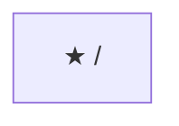

### /agents

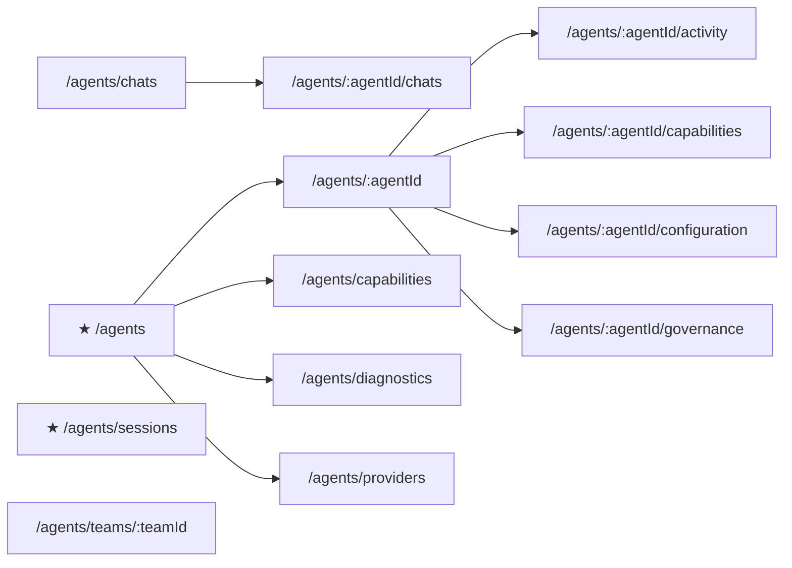

### /collaboration

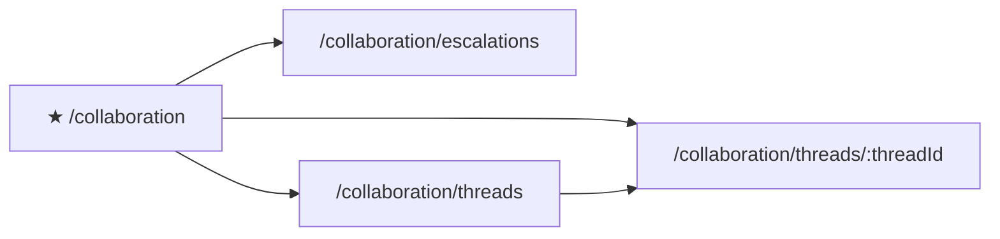

### /crm-hr

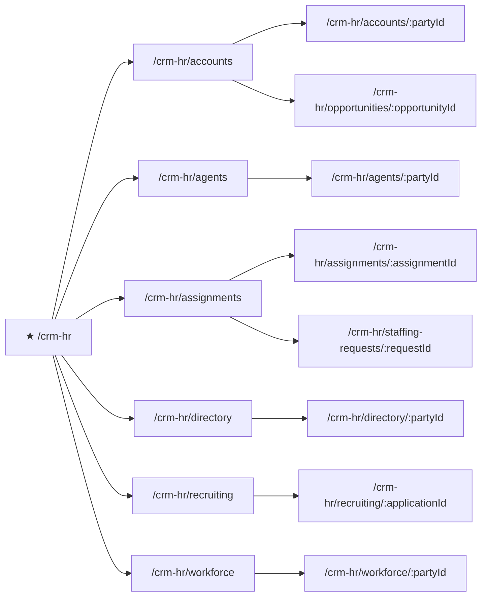

### /memory

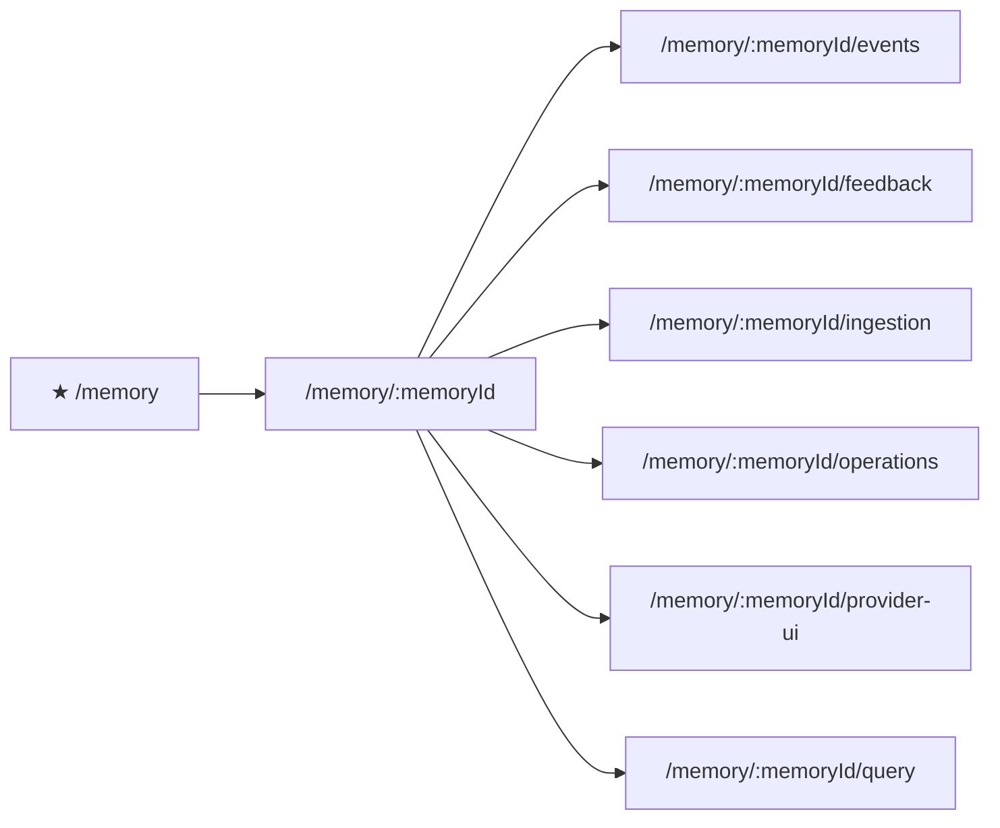

### /plugins

### /processes

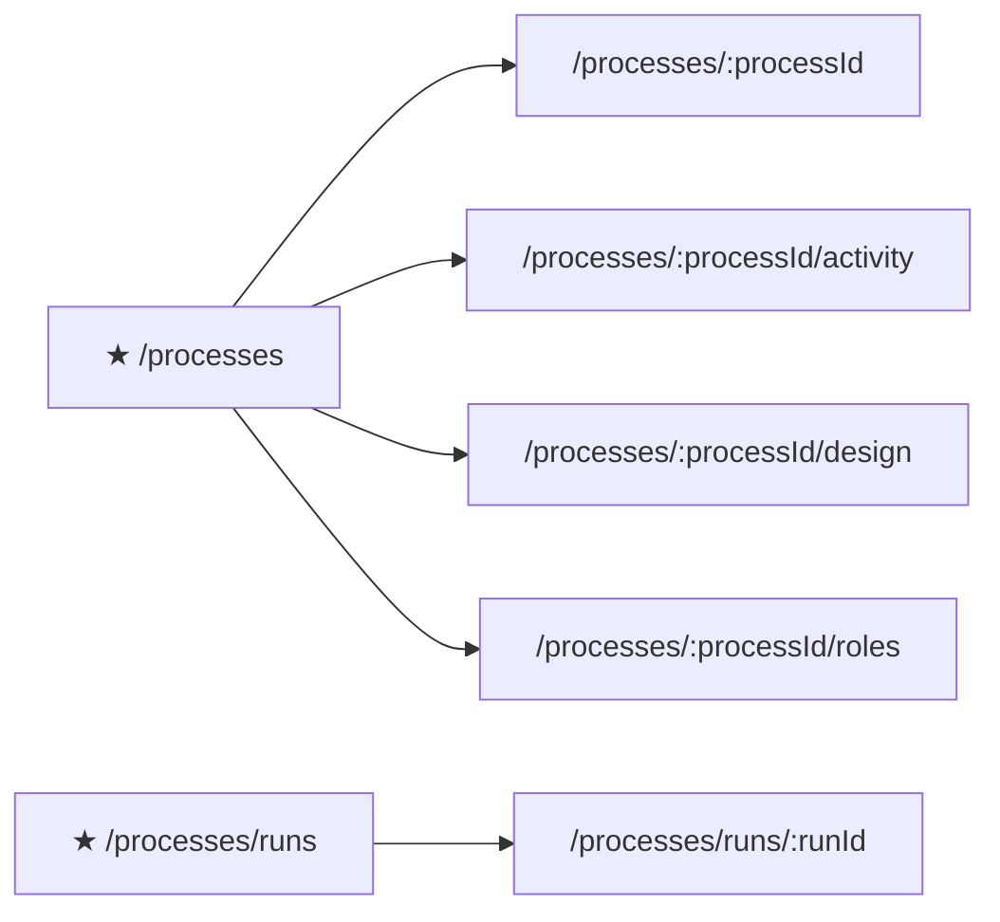

### /projects

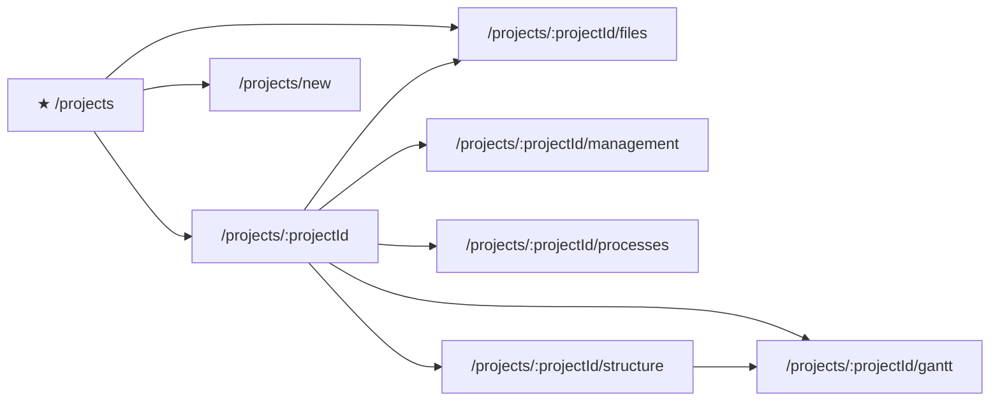

### /prompts

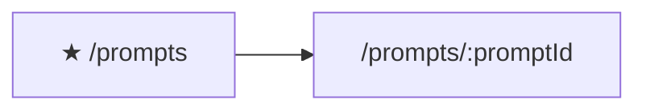

### /resources

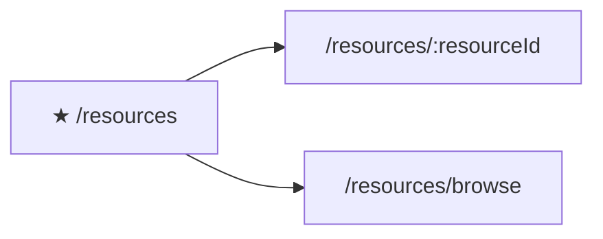

### /scheduler

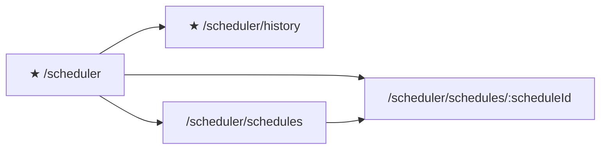

### /settings

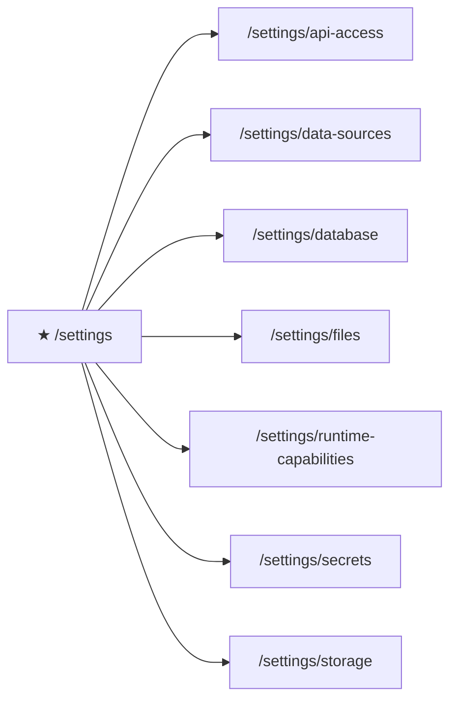

### /test-lab

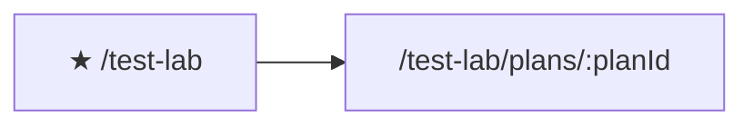

### /workflows

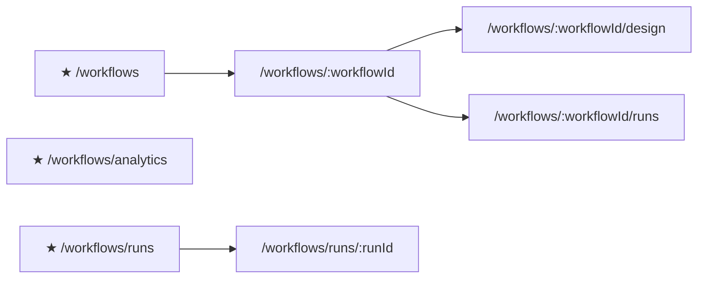

### All modules

```mermaid
flowchart LR
  subgraph mod-root["/"]
    root["★ /"]
  end
  subgraph mod-agents["/agents"]
    agents["★ /agents"]
    agents-agentId["/agents/:agentId"]
    agents-agentId-activity["/agents/:agentId/activity"]
    agents-agentId-capabilities["/agents/:agentId/capabilities"]
    agents-agentId-chats["/agents/:agentId/chats"]
    agents-agentId-configuration["/agents/:agentId/configuration"]
    agents-agentId-governance["/agents/:agentId/governance"]
    agents-capabilities["/agents/capabilities"]
    agents-chats["/agents/chats"]
    agents-diagnostics["/agents/diagnostics"]
    agents-providers["/agents/providers"]
    agents-sessions["★ /agents/sessions"]
    agents-teams-teamId["/agents/teams/:teamId"]
  end
  subgraph mod-collaboration["/collaboration"]
    collaboration["★ /collaboration"]
    collaboration-escalations["/collaboration/escalations"]
    collaboration-threads["/collaboration/threads"]
    collaboration-threads-threadId["/collaboration/threads/:threadId"]
  end
  subgraph mod-crm-hr["/crm-hr"]
    crm-hr["★ /crm-hr"]
    crm-hr-accounts["/crm-hr/accounts"]
    crm-hr-accounts-partyId["/crm-hr/accounts/:partyId"]
    crm-hr-agents["/crm-hr/agents"]
    crm-hr-agents-partyId["/crm-hr/agents/:partyId"]
    crm-hr-assignments["/crm-hr/assignments"]
    crm-hr-assignments-assignmentId["/crm-hr/assignments/:assignmentId"]
    crm-hr-directory["/crm-hr/directory"]
    crm-hr-directory-partyId["/crm-hr/directory/:partyId"]
    crm-hr-opportunities-opportunityId["/crm-hr/opportunities/:opportunityId"]
    crm-hr-recruiting["/crm-hr/recruiting"]
    crm-hr-recruiting-applicationId["/crm-hr/recruiting/:applicationId"]
    crm-hr-staffing-requests-requestId["/crm-hr/staffing-requests/:requestId"]
    crm-hr-workforce["/crm-hr/workforce"]
    crm-hr-workforce-partyId["/crm-hr/workforce/:partyId"]
  end
  subgraph mod-memory["/memory"]
    memory["★ /memory"]
    memory-memoryId["/memory/:memoryId"]
    memory-memoryId-events["/memory/:memoryId/events"]
    memory-memoryId-feedback["/memory/:memoryId/feedback"]
    memory-memoryId-ingestion["/memory/:memoryId/ingestion"]
    memory-memoryId-operations["/memory/:memoryId/operations"]
    memory-memoryId-provider-ui["/memory/:memoryId/provider-ui"]
    memory-memoryId-query["/memory/:memoryId/query"]
  end
  subgraph mod-plugins["/plugins"]
    plugins["★ /plugins"]
    plugins-pluginId["/plugins/:pluginId"]
  end
  subgraph mod-processes["/processes"]
    processes["★ /processes"]
    processes-processId["/processes/:processId"]
    processes-processId-activity["/processes/:processId/activity"]
    processes-processId-design["/processes/:processId/design"]
    processes-processId-roles["/processes/:processId/roles"]
    processes-runs["★ /processes/runs"]
    processes-runs-runId["/processes/runs/:runId"]
  end
  subgraph mod-projects["/projects"]
    projects["★ /projects"]
    projects-projectId["/projects/:projectId"]
    projects-projectId-files["/projects/:projectId/files"]
    projects-projectId-gantt["/projects/:projectId/gantt"]
    projects-projectId-management["/projects/:projectId/management"]
    projects-projectId-processes["/projects/:projectId/processes"]
    projects-projectId-structure["/projects/:projectId/structure"]
    projects-new["/projects/new"]
  end
  subgraph mod-prompts["/prompts"]
    prompts["★ /prompts"]
    prompts-promptId["/prompts/:promptId"]
  end
  subgraph mod-resources["/resources"]
    resources["★ /resources"]
    resources-resourceId["/resources/:resourceId"]
    resources-browse["/resources/browse"]
  end
  subgraph mod-scheduler["/scheduler"]
    scheduler["★ /scheduler"]
    scheduler-history["★ /scheduler/history"]
    scheduler-schedules["/scheduler/schedules"]
    scheduler-schedules-scheduleId["/scheduler/schedules/:scheduleId"]
  end
  subgraph mod-settings["/settings"]
    settings["★ /settings"]
    settings-api-access["/settings/api-access"]
    settings-data-sources["/settings/data-sources"]
    settings-database["/settings/database"]
    settings-files["/settings/files"]
    settings-runtime-capabilities["/settings/runtime-capabilities"]
    settings-secrets["/settings/secrets"]
    settings-storage["/settings/storage"]
  end
  subgraph mod-test-lab["/test-lab"]
    test-lab["★ /test-lab"]
    test-lab-plans-planId["/test-lab/plans/:planId"]
  end
  subgraph mod-workflows["/workflows"]
    workflows["★ /workflows"]
    workflows-workflowId["/workflows/:workflowId"]
    workflows-workflowId-design["/workflows/:workflowId/design"]
    workflows-workflowId-runs["/workflows/:workflowId/runs"]
    workflows-analytics["★ /workflows/analytics"]
    workflows-runs["★ /workflows/runs"]
    workflows-runs-runId["/workflows/runs/:runId"]
  end
  agents --> agents-agentId
  agents --> agents-capabilities
  agents --> agents-diagnostics
  agents --> agents-providers
  agents-agentId --> agents-agentId-activity
  agents-agentId --> agents-agentId-capabilities
  agents-agentId --> agents-agentId-configuration
  agents-agentId --> agents-agentId-governance
  agents-chats --> agents-agentId-chats
  collaboration --> collaboration-escalations
  collaboration --> collaboration-threads
  collaboration --> collaboration-threads-threadId
  collaboration-threads --> collaboration-threads-threadId
  crm-hr --> crm-hr-accounts
  crm-hr --> crm-hr-agents
  crm-hr --> crm-hr-assignments
  crm-hr --> crm-hr-directory
  crm-hr --> crm-hr-recruiting
  crm-hr --> crm-hr-workforce
  crm-hr-accounts --> crm-hr-accounts-partyId
  crm-hr-accounts --> crm-hr-opportunities-opportunityId
  crm-hr-agents --> crm-hr-agents-partyId
  crm-hr-assignments --> crm-hr-assignments-assignmentId
  crm-hr-assignments --> crm-hr-staffing-requests-requestId
  crm-hr-directory --> crm-hr-directory-partyId
  crm-hr-recruiting --> crm-hr-recruiting-applicationId
  crm-hr-workforce --> crm-hr-workforce-partyId
  memory --> memory-memoryId
  memory-memoryId --> memory-memoryId-events
  memory-memoryId --> memory-memoryId-feedback
  memory-memoryId --> memory-memoryId-ingestion
  memory-memoryId --> memory-memoryId-operations
  memory-memoryId --> memory-memoryId-provider-ui
  memory-memoryId --> memory-memoryId-query
  plugins --> plugins-pluginId
  processes --> processes-processId
  processes --> processes-processId-activity
  processes --> processes-processId-design
  processes --> processes-processId-roles
  processes-runs --> processes-runs-runId
  projects --> projects-projectId
  projects --> projects-projectId-files
  projects --> projects-new
  projects-projectId --> projects-projectId-files
  projects-projectId --> projects-projectId-gantt
  projects-projectId --> projects-projectId-management
  projects-projectId --> projects-projectId-processes
  projects-projectId --> projects-projectId-structure
  projects-projectId-structure --> projects-projectId-gantt
  prompts --> prompts-promptId
  resources --> resources-resourceId
  resources --> resources-browse
  scheduler --> scheduler-history
  scheduler --> scheduler-schedules
  scheduler --> scheduler-schedules-scheduleId
  scheduler-schedules --> scheduler-schedules-scheduleId
  settings --> settings-api-access
  settings --> settings-data-sources
  settings --> settings-database
  settings --> settings-files
  settings --> settings-runtime-capabilities
  settings --> settings-secrets
  settings --> settings-storage
  test-lab --> test-lab-plans-planId
  workflows --> workflows-workflowId
  workflows-workflowId --> workflows-workflowId-design
  workflows-workflowId --> workflows-workflowId-runs
  workflows-runs --> workflows-runs-runId
```
